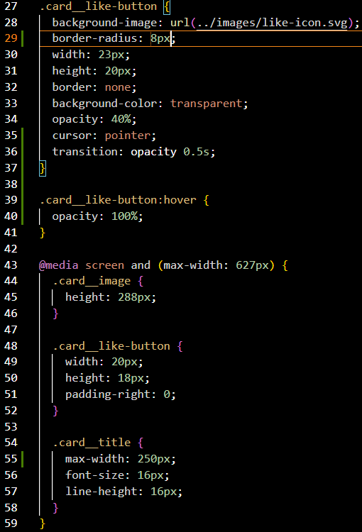
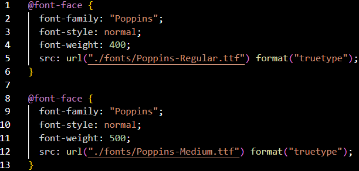
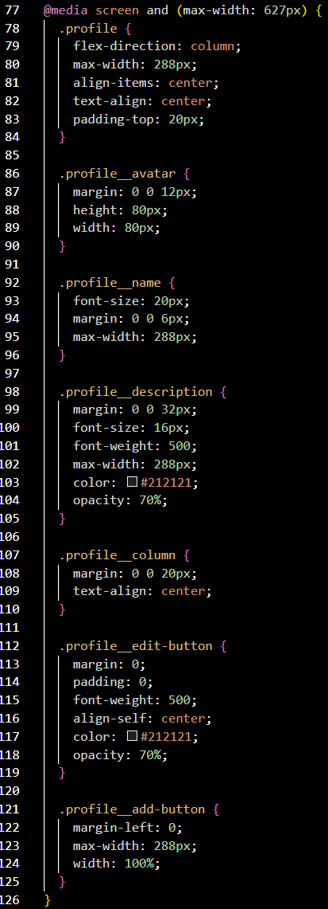

# Spots

This is the third project of the Software Engineering program at TripleTen. It was created using HTML and CSS, based on the design brief in Figma.

## Project features

- Semantic HTML5
- Flexbox
- CSS grid layout
- Positioning
- Flat BEM file structure
- A custom form
- Hover states
- Compatibility and flexability with different sized screens

## Plans on improving the project

- Animations and hover effects
- Custom buttons and text entry

## Video overview of HTML and CSS

https://drive.google.com/file/d/1RGZ0pifKQswcrN_SVzq451bOQ-TgCbu3/view?usp=sharing

## Images

- .card like-button code and media queries for .card
  
- font-face import code for different font-weights
  
- media query for profile blocks/elements to be used on smaller screens
  
